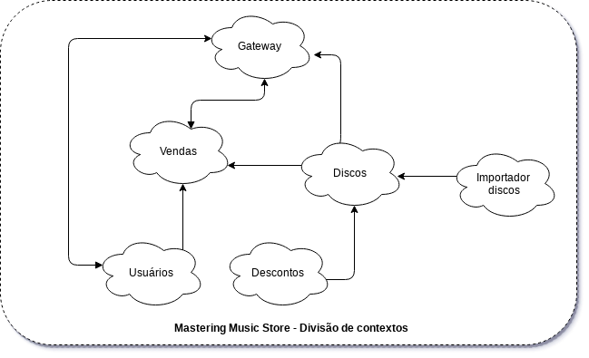

# Mastering Music Store

O projeto 'Mastering Music Store' será desenvolvido para validar meus conhecimento das várias tecnologias 
utilizadas atualmente no mercado de trabalho. Não pretendo entrar em detalhes ou prover conhecimentos para soluções definitivas, ou servir como base de uma 'implementação adequada' - muito longe disso, é apenas um projeto com uma grande gama de tecnologia abordada de forma simples.

O objetivo é estudar e melhorar ainda mais meus conhecimentos, além de poder ajudar desenvolvedores novos ou 
experientes a aplicar esses conceitos em sua empresa, todo o projeto é de código aberto e qualquer um que quiser 
contribuir será bem-vindo.

## Tecnologias

 As tecnologias empregadas nesse projeto seram distribuidas conforme a necessidade de cada serviço.

 - [`Microservices`](https://www.infoq.com/br/articles/microservices-intro/) - Técnicas de desenvolvimento de software baseado em micro serviços
 - [`Domain-Driven Design (DDD)`](https://en.wikipedia.org/wiki/Domain-driven_design) - Abordagem para desenvolvimento de software para necessidades complexas
 - [`CircleCI`](https://circleci.com) - Plataforma de CI/CD
 - [`ELK`](https://www.elastic.co/elk-stack) - Realizar monitoramento de log, O Stack Elastic (ELK) é o conjunto formado pelas ferramentas Elasticsearch, Kibana, Logstash
 - [`Spring Cloud Netflix (Zuul, Eureka)`](https://spring.io/projects/spring-cloud-netflix) - O Spring Cloud Netflix fornece integrações Netflix OSS para aplicativos Spring Boot 
 - [`Spring boot`](https://spring.io) - Framework base para a API
 - [`Flyway`](https://flywaydb.org) - Controle de versão e migração para banco de dados
 - [`MySQL`](https://www.mysql.com) - Banco de dados SQL
 - [`MongoDB`](https://www.mongodb.com) - Banco de dados NoSQL
 - [`H2`](https://www.h2database.com) - Banco de dados para os testes
 - [`Swagger`](https://swagger.io) - Documentação de API de forma dinâmica
 - [`JPA/Hibernate`](https://hibernate.org/orm/) - Framework para persistencia de dados / ORM
 - [`Docker`](https://www.docker.com) - Executa e gerencia aplicações dentro de invólucros chamados containers
 - [`RabbitMQ`](https://www.rabbitmq.com) - RabbitMQ é um servidor de mensageria
 - [`jUnit5 e Mockito`](https://junit.org/junit5/) - Framework para execução de testes

## Sobre o projeto

Irei utilizar como referência todo o escopo do projeto [`music-store-api`](https://github.com/gbzarelli/music-store-api); O Music Store API trata-se de uma API para consultas e vendas de discos, sua base de dados é alimentada pela API do Spotify, na venda do disco é gerado um `cashback` de acordo com o dia da semana e o genêro de cada disco. A idéia do Mastering Music Store é a mesma, disponibilizar API's para consultas e vendas de discos e cadastro de usuários.

### Especificações

- TO DO

## Desenvolvimento

Utilizando a idéia do [`music-store-api`](https://github.com/gbzarelli/music-store-api), irei desenvolver todo o sistema em API's separadas, vou elevar um pouco a complexidade do sistema inserindo uma autenticação por usuário no momento da realização de uma `Venda`, porém essa complexidade ficará na `API Gateway` que será desenvolvida utilizando a dependência do `Spring Cloud Netflix - Zuul`, em complemento ao Zuul, será implementado o `Spring Cloud Netflix - Eureka` como [Service Discovery](https://microservices.io/patterns/server-side-discovery.html) para termos um melhor controle dos serviços em execução e permitir futuramente um `Load Balance`[(Ribbon)](https://spring.io/guides/gs/client-side-load-balancing/) adequado.

A imagem a seguir mostra como será feita a divisão de contextos:

Atravéz dessa divisão, definimos os seguintes serviços para nosso sistema:

- Usuário
- Venda
- Discos
- Descontos
- Importação

A porta de entrada `API Gateway` receberá as requisições e disponibilizará rotas apenas para os serviços de `Usuário`, `Venda` e `Discos`, os demais estarão protegidos pois são responsavéis apenas para trafegos internos na rede. 

Ainda sobre o desenvolvimento irei utilizar uma outra API do `Spring Cloud` o [`Spring Cloud Config`](https://spring.io/projects/spring-cloud-config), o Spring Cloud Config fornece suporte ao servidor e ao cliente para externalizar configurações em um sistema distribuído.

...

_______________________

# PROJECT IN DEVELOPMENT

_______________________

## Contributing
Pull requests are welcome. For major changes, please open an issue first to discuss what you would like to change.

Please make sure to update tests as appropriate.

## License
[MIT](https://choosealicense.com/licenses/mit/)
